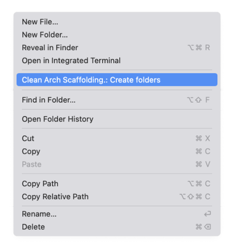
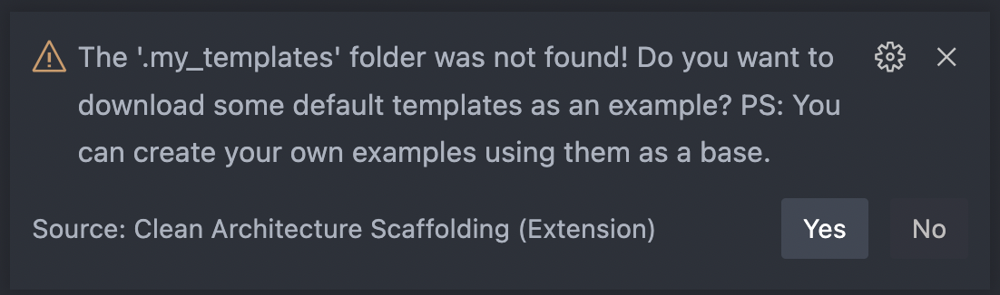
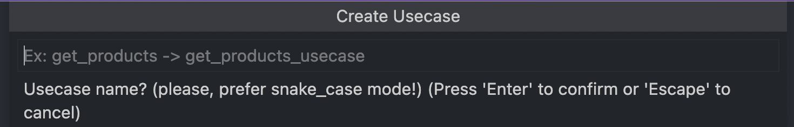
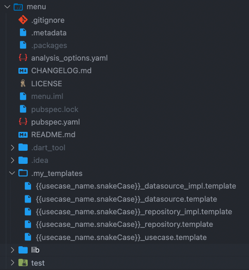
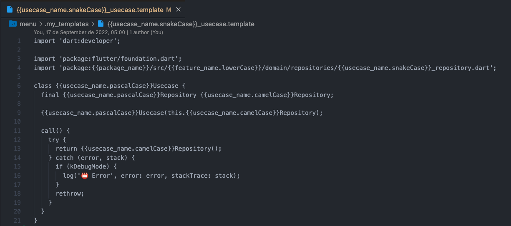

# Clean Architecture Scaffolding README
## This extension is working in progress, the version 1.0.0 will be the stable version. 

It generates a folder structure according to your own template.
Take a look at the settings page.

#### If this extension was useful to you, please, give it five stars.  By doing this you help other devs to standardize their code making the work much better for the whole community. Think about it.

## Features
### STEP 01:   
Right-click on any folder in your project and then click "Clean Arch Scaffolding.: Create folders".  
 

Enter the name of your New feature:  
 

The directories will be created according to the template defined in the settings. 
 
### STEP 02:   
Right-click in folder called 'usecase' (Don't worry, we use regex to identify any folder with usecase in the name to show this menu option!) then click "Clean Arch Scaffolding.: New usecase".  
 

If the my templates folder does not exist, a dialog will open asking you to download some examples from the web. 
Click Yes and the folder will be created with the templates inside.

 

Try again and repeat this last step.
A dialog will appear asking for your use case name.

 

The source files will be created in accord with templates in folder ".my_templates" of your project:  
 

You can write the template file using special keywords. 
Look this sample: 
 
#### Write your own templates and share with us:
Search this repository for more templates.: 
https://github.com/euclidesgc/clean-architecture-scaffolding/tree/main/.my_templates

### Settings:
If you want to adapt the template, go to the extension settings and edit the json with the templates. 
 

#### You can use this special keywords to indicates some locations: 
- **{{package_name}}** to get name of your package in pubspec.yaml file; 
- **{{root_folder}}** to first folder of your projetc; 
- **{{custom_folder}}** to clicked folder; 
- **{{feature_name}}** to use the given custom name; 
- **{{usecase_name}}** to use a given usecase name; 

#### And you can associate this keywords with this format pattern too as given below:
- **{{usecase_name.lowerCase}}** to use a given usecase name with lowercase pattern; 
- **{{usecase_name.upperCase}}** to use a given usecase name with UPPERCASE pattern;   
- **{{usecase_name.snakeCase}}** to use a given usecase name with snake_case pattern (indicate to file path names); 
- **{{usecase_name.pascalCase}}** to use a given usecase name with PascalCase pattern (indicate to Class names); 
- **{{usecase_name.camelCase}}**  to use a given usecase name with camelCase pattern (indicate to variables names). 

**Ex. 01 (Template file):** '{{custom_folder}}/{{feature_name}}/domain/usecases/{{usecase_name.snakeCase}}.template' 

**Ex. 02 (Folder only):** '{{custom_folder}}/{{feature_name}}/domain/entities/' 
> Attention:  
> End Folders only template with '/' or it will be ignored.  
> Remember, files do not always have an extension. ;)

## Extension Settings

* `scaffolding.layers.templates`: Array of strings with folder template definitions.

**Enjoy!**