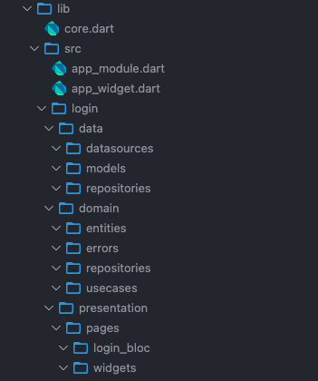

# clean-architecture-scaffolding README

It generates a folder structure according to your own template.
Take a look at the settings page.

## Features

Right-click on any folder in your project and then click "Clean Arch Scaffolding > New Feature".
Enter the name of your new feature and the directories will be created according to the template defined in the settings.

For example if there is an image subfolder under your extension project workspace:

![Clean Arch Scaffolding > New Feature] (images/menu.png)
![Give a feature name] (images/feature_name.png)
![The folders will be created] (images/folders.png)
![Like this default settings] (images/settings.png)
![Using this folders templates] (images/json.png)

## Extension Settings

Include if your extension adds any VS Code settings through the `contributes.configuration` extension point.

For example:

This extension contributes the following settings:

* `scaffolding.layers.templates`: Array of strings with folder template definitions.
* `scaffolding.layers.test`: Check to create the same structure in test folder too.

## Release Notes

This initial version generates only the folders.
In the next versions we will also add some file templates according to the context of the clicked folder.

## Following extension guidelines

Ensure that you've read through the extensions guidelines and follow the best practices for creating your extension.

* [Extension Guidelines](https://code.visualstudio.com/api/references/extension-guidelines)

**Enjoy!**
